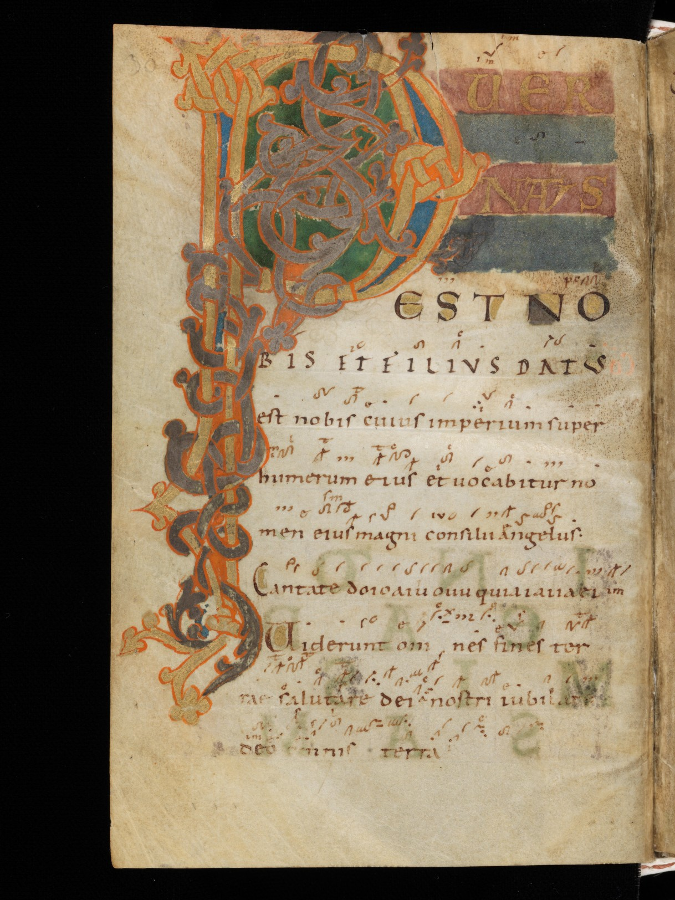
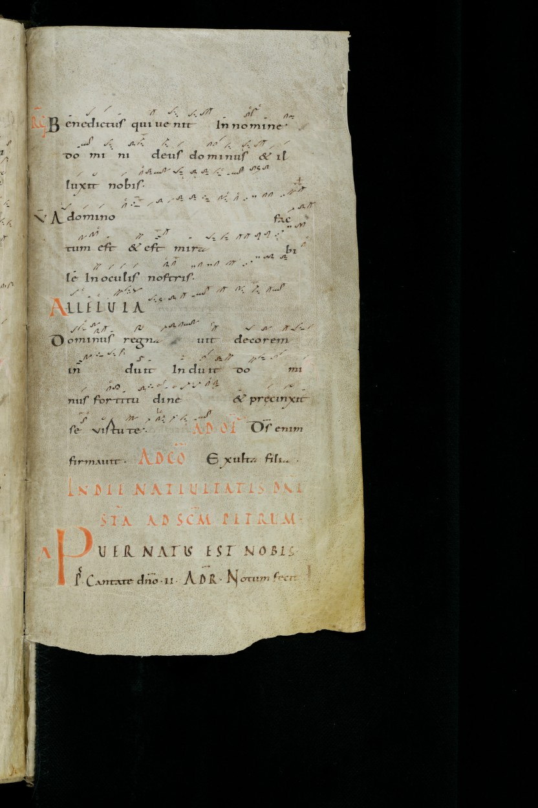
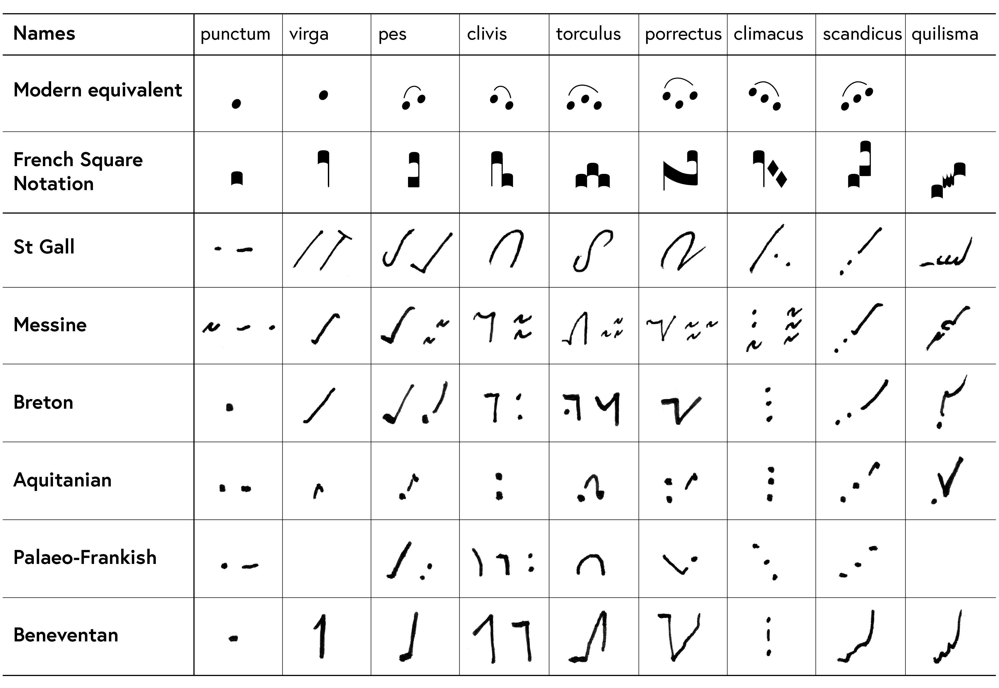
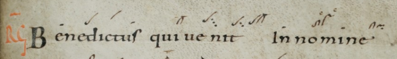

# THE CHANT TEAM

---

# WHO WE ARE

* Toni Amrstrong, Clark University
* Julia Speigel, College of the Holy Cross
* Hannah Nguyen, College of the Holy Cross
* Marika Fox, Clark University

---

---

---

## Neumes

---

## Creating a Virgapes

- An alphabet of neumes

- Format: numberOfPitches.IDNumber.Episema.Liquescence

- Example: 1.1.0.0 - virga

- 1.2.0.0 - punctum

---

## This Year

- Let's get editing!
- Adding SG 359 for comparisons
- Cross-referenced digital text with linked text, neumes, and images

---

## Conferences Last Year!

   - International Congress on Medieval Studies (May 2018, Kalamazoo)
   - Digital Humanities Conference (June 2018, Mexico City)

---

## JOIN US!

- Our only prerequisite is a working knowledge of the English alphabet.
- github.com/HCMID/Chant
